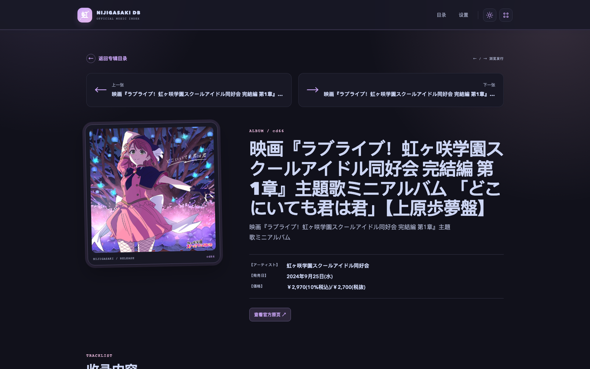

# nijidb-web
虹咲官方音乐商品与节目档案的本地 Web UI，以及更新通知服务。

## 界面预览



## 生产启动

```bash
docker build -t nijidb-web .
docker run -d --name nijidb-web -p 8000:8000 \
  -v nijidb-data:/data \
  -e ADMIN_USERNAME=admin \
  -e ADMIN_PASSWORD='change-this-password' \
  -e ADMIN_SECRET='change-this-secret' \
  nijidb-web
```

打开 `http://localhost:8000`。设置页默认每 10 分钟检查一次目录、每 5 分钟检查一次异步详情，两个间隔都可以分别调整。OneBot 的地址、Token 和目标写入管理员设置页。首次抓取仅初始化数据库，之后新增或发生变化的条目才会通知。

`ADMIN_PASSWORD` 只在数据卷首次初始化时作为初始密码使用，数据库中保存的是 PBKDF2-SHA256 哈希。登录设置页后可以通过“修改管理员密码”更新，之后密码以 `/data/nijidb.sqlite3` 中的值为准；迁移到新宿主机时请一并保留 `nijidb-data` 数据卷。

## R2 图片

运行时封面保存在 `/data/images`。`scripts/upload_images_to_r2.py` 使用 S3 API 将该目录全量上传到 Cloudflare R2，凭证只从环境变量读取，不要写入仓库。S3 Endpoint 仅用于上传；要让浏览器读取图片，还需要在 `R2_PUBLIC_BASE_URL` 填写 R2 自定义域名或 `r2.dev` 公共地址。

```bash
R2_ENDPOINT='https://你的账户.r2.cloudflarestorage.com' \
R2_BUCKET='nijidb' \
R2_ACCESS_KEY_ID='你的 Access Key ID' \
R2_SECRET_ACCESS_KEY='你的 Secret Access Key' \
R2_PUBLIC_BASE_URL='https://你的公开图片域名' \
docker run --rm --mount source=nijidb-data,target=/data \
  --mount type=bind,src="$PWD/scripts",dst=/scripts,readonly \
  -e R2_ENDPOINT -e R2_BUCKET -e R2_ACCESS_KEY_ID -e R2_SECRET_ACCESS_KEY -e R2_PUBLIC_BASE_URL \
  --entrypoint python nijidb-web /scripts/upload_images_to_r2.py --rewrite-db
```

`--rewrite-db` 会先在数据目录创建 SQLite 备份，再把数据库和详情 HTML 中的 `/media/...` 引用改为公开 R2 URL。没有公开访问地址时可以省略该参数，仅执行图片上传。后续同步只配置 Endpoint、Bucket 和 S3 凭证时，会自动把新封面上传到 R2 但继续使用本地 `/media` 引用；补充 `R2_PUBLIC_BASE_URL` 后，才会同时生成 R2 引用。

## 开发调试

后端和前端分开启动，Vue 页面由 Vite 提供热更新，修改前端组件或样式时不需要重启服务：

```bash
# 终端一：FastAPI，后端代码修改自动重载
uvicorn app.main:app --reload --port 8000

# 终端二：Vue + Vite，前端修改即时 HMR
cd frontend
npm install
npm run dev
```

打开 `http://localhost:5173`。Vite 会把 `/api` 和 `/media` 请求代理到 `http://127.0.0.1:8000`；如果后端使用其他地址，可设置 `VITE_BACKEND_URL`。生产 Docker 镜像会自动构建 `frontend/dist`，无需手动执行前端构建。

## 节目档案

打开 `/programs` 查看节目播出日历；登录后打开 `/admin/programs` 手动维护节目资料和排期。排期支持周更、固定月更、逐期设置、单次和多个分段时期，每个时期可以选择更新时间时区。逐期设置会按月生成每月 1 日作为占位，之后可在单集列表中直接修改每期原定日期和时间。对异常节目的单集列表可以关闭后续自动生成，改用“添加单集”逐条录入，也可以将固定月更批量切换为逐期设置，或将已改期日期和时间覆盖为新的原定播出日期和时间。一个主节目下可以挂载多个独立配置的子节目，主节目 key 固定为“主节目”。开启自动生成的进行中节目会按规则生成未来约半年的单集，也可以对单集进行改期、取消或补录。“未更新”仅按当前排期规则推算，不代表真实播出状态。

节目编辑页支持单节目 JSON 导入和导出。导出可以选择“完整逐期快照”或“排期规则 + 例外”：前者会展开当前有效单集，适合交给 AI 优化内容后覆盖导回；后者保留自动生成规则，并把当前自动生成结果标记为 `generated`，未修改的自动单集导入后仍由规则生成，补充了内容的单集会保存为覆盖。每个单集都可以填写可选的 `title`，有值时会显示在日历、单集详情和 JSON 中。JSON v2 的 `import_options.schedule_mode` 默认是 `individual`，导入的单集会作为准确最终数据且不会自动生成；设置为 `generated` 才会按 `periods` 自动生成。导入会先显示节目、排期和全部单集预览，默认新建；检测到同 ID 或同名称的节目时，可以明确选择覆盖并再次确认。JSON 导入写入前、数据库还原前和每天 00:00（Asia/Tokyo）会自动将当前数据库备份到数据卷的 `/data/backups`，并最多保留最近 30 份；设置页可以查看、下载和还原这些备份。格式模板见 [`docs/program-json-template.json`](docs/program-json-template.json)；说明字段使用合法 JSON 的 `_field_notes` 和 `_import_notes`，也兼容 `//`、`/* */` 注释。

## TODO / Roadmap

- [ ] 数据库查询页：按标题、艺术家、日期和发行 ID 搜索。
- [ ] 虹咲其他官方资料页：成员、音乐、活动和新闻等。
- [x] 节目档案页：整理官方和个人节目资料。
- [ ] 联动立绘页：整理联动视觉和相关出处。
- [ ] 艺术家详情页：关联作品、曲目和 credit。
- [ ] 跨平台账号映射和艺术家关系表。
- [ ] 补充同步、解析和数据迁移测试。

## 换宿主机

只要新宿主机可以访问 Docker Registry、npm Registry 和官方站点的 HTTPS，下面的镜像构建和运行流程不依赖当前宿主机的本地代码或缓存数据：

```bash
docker build -t nijidb-web .
docker run -d --name nijidb-web --restart unless-stopped -p 8000:8000 \
  -v nijidb-data:/data \
  -e ADMIN_USERNAME='你的管理员账号' \
  -e ADMIN_PASSWORD='首次启动密码' \
  -e ADMIN_SECRET='随机长字符串' \
  nijidb-web
```

容器启动后会立即检查 `cd.php`；之后异步检查 `cd_detail.php`，封面会下载到 `/data/images`，页面由镜像内的 Vue `dist` 提供。新宿主机使用全新的 `nijidb-data` 时会重新建立数据库并抓取资料；迁移旧卷时会保留已有资料和已经修改过的管理员密码。抓取能否成功取决于新宿主机的 DNS、HTTPS 出站网络和目标站点对该出口 IP 的访问限制。

如果 OneBot 跑在宿主机而不是另一个容器内，OneBot 地址不要填写容器内的 `127.0.0.1`：Docker Desktop 通常使用 `http://host.docker.internal:端口`，Linux 则使用宿主机网关地址或把两个容器加入同一个 Docker network。
